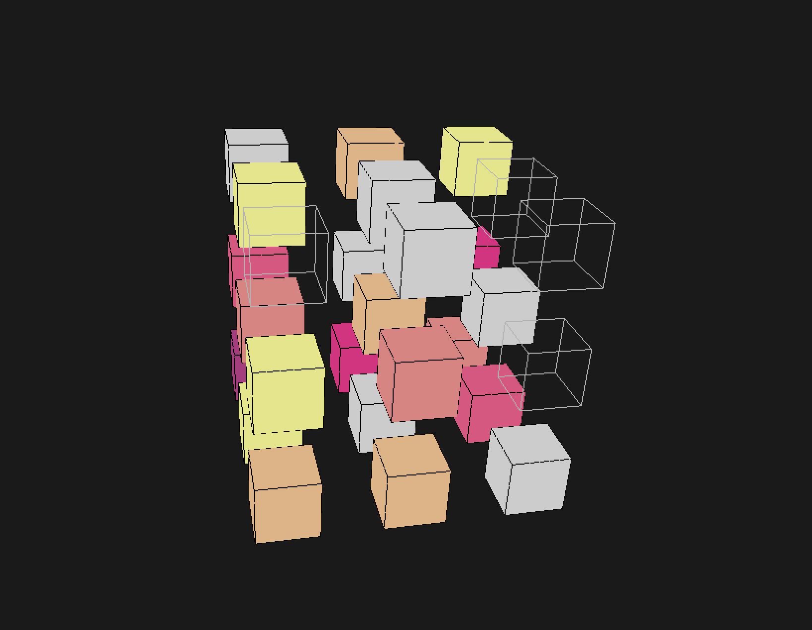

# Training a Computer to Play 2048 in 3D

By Tianlin Yue, Yizhuo Chang, Stephanie Su, Zizhan Wei, Jacob Titcomb, Yinqi Yao, and Zhekai Zheng

This respository is a part of a capstone project for MATH 148 at UCLA entitled "Developing an AI Agent for 3D 2048 Using Deep Q-Learning."

Feel free to try for yourself!

## Overview

Our project studies a 3-dimensional variation on the game 2048, originally designed by [Gabriele Cirulli](https://github.com/gabrielecirulli/2048). We construct the game environment and train an AI agent to play the game for a $3\times 3\times 3$ board. Employing a Dueling Deep Q-Learning model, the code in this repository documents our development process: neural network design to model training and eventually model testing.

Unfortunately, the checkpoint files are too large to upload to GitHub, but they can be accessed through [this Google drive](https://drive.google.com/drive/folders/1L27GUpmwOVPkFXj1C2p-MhDYwcXUKvj-?usp=sharing).

## Repository Summary

1. `game_implementation.py`implements the 3-dimensional game, playable by user or computer.

2. Running `playable_game.py` allows the user to play 2048, with specifiable parameters such as the dimensions of the game environment and the desired finishing tile value.

3. Getting to the heart of the project, `model_construction.py` constructs the Dueling Deep Q-Learning model. The neural network is built primarily using `PyTorch`.

4. `training.py` and `testing.py` have the functions to perform training and testing. You can train the model using `execute_training.py`.

5. Finally, `execute_testing.py` lets the AI agent play the game for itself! You can also visualize the gameplay using our implementation with `pygame` and `OpenGL` in the file `visualize_game.py`.

We ran simulations of the training and testing portions as part of our analysis. Check out the folder `simulation_analysis` for more information.
